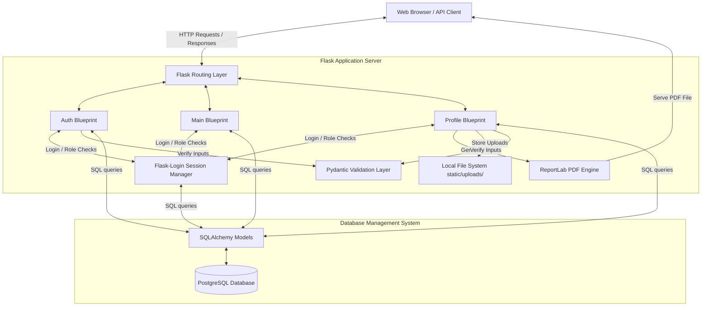

# Architecture & Systems Understanding Guide

This document describes the structure, components, and relationships of the Flask Talent Portal in plain, straightforward English.

---

## 1. System Architecture Diagram

This diagram shows how data flows through the application's layers, from the user's browser down to the database and PDF generation subsystems.

---

## 2. Plain English Explanation of the Architecture

The application is structured into four main layers:

### A. The Client Layer (The Browser / API Client)
The browser renders the basic HTML pages, handles client-side form submissions, runs simple validation rules (like verifying matching passwords or valid email formats), and displays PDF documents. It is the interface that users interact with.

### B. The Routing and Business Logic Layer (Flask Blueprints)
To keep the application modular and organized, the code is split into three main modules called **Blueprints**:
1.  **Auth Blueprint**: Manages registration, logins, and logouts. It also keeps track of login attempts to temporarily block brute-force attacks from the same IP address.
2.  **Profile Blueprint**: Coordinates creating, editing, and displaying talent profiles, as well as compiling and serving them as PDF files.
3.  **Main Blueprint**: Manages the public search directory, the dashboard view, the admin panel, and the public API endpoints.

### C. The Data Validation Layer (Pydantic v2 Schemas)
When a user submits a form (such as signing up or updating their bio), the data goes through the Pydantic validation layer. Pydantic ensures that fields are not empty, emails are valid, and passwords comply with the portal's security policies.

### D. The Storage Layer (Database & Local Disk)
*   **The Database (SQLAlchemy & PostgreSQL)**: Stores relational data. There are two tables:
    *   `users`: Contains credentials and account roles.
    *   `talent_profiles`: Contains descriptions, links, and filenames of uploaded profile images.
*   **The Local Disk**: Uploaded profile images are checked for safety, renamed with a unique prefix, and saved in `app/static/uploads/`.

---

## 3. Key Relationships and Security

### One-to-One Database Relationship
Each account in the `users` table can have only one matching profile in the `talent_profiles` table (linked via the user's ID). If a user account is deleted, the database automatically deletes their profile as well to prevent orphan records.

### Role-Based Security
*   All users default to the `'user'` role when they register.
*   The application includes an `'admin'` role.
*   The `@admin_required` decorator sits in front of administrative routes (such as the list and delete routes). It inspects the logged-in user's session credentials and blocks access (returning a `403 Forbidden` error) if they do not hold an admin role.
*   For security, passwords are encrypted using `bcrypt` before being stored. The application only compares hashes, meaning plaintext passwords are never saved on the server.
