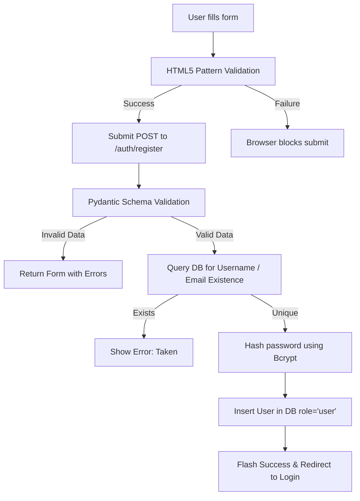
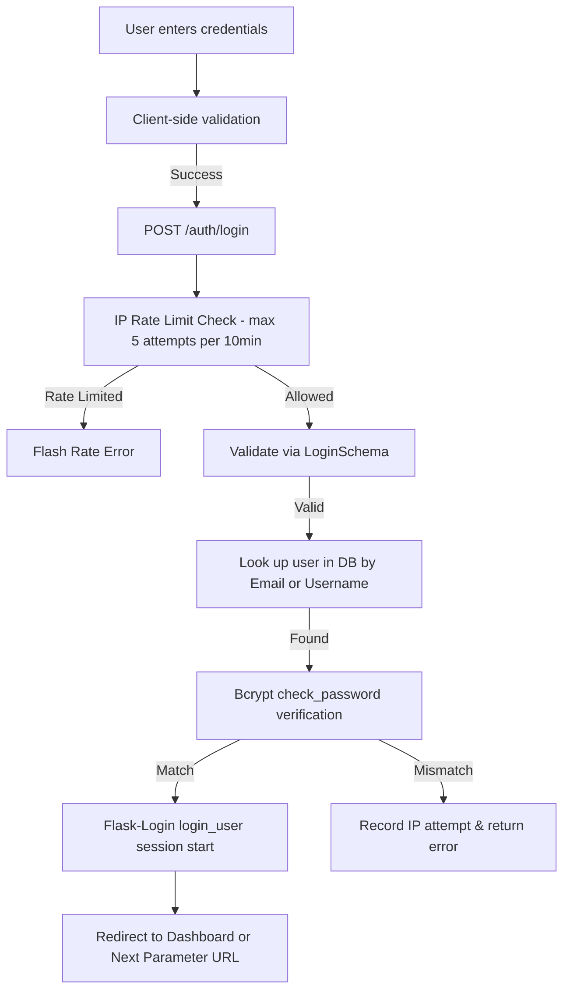
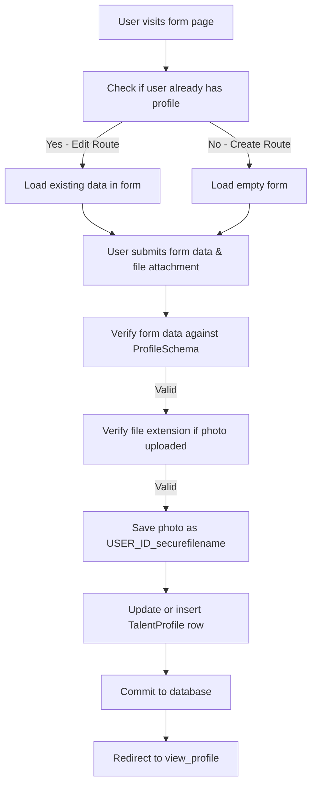
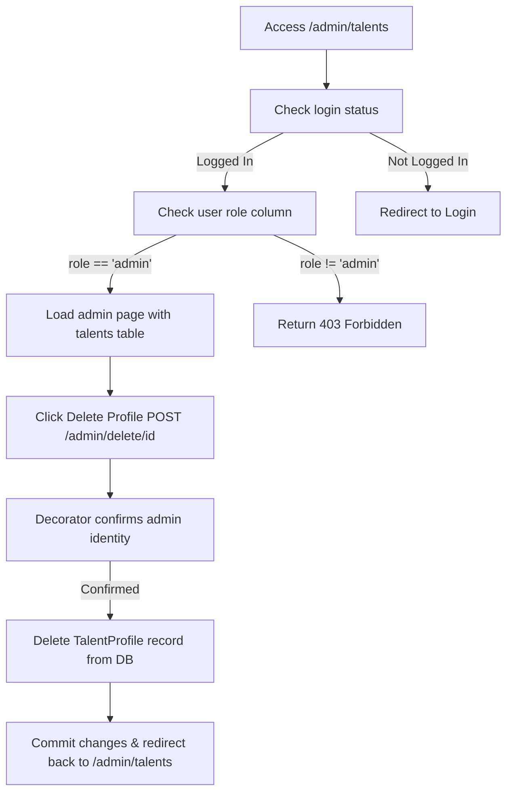
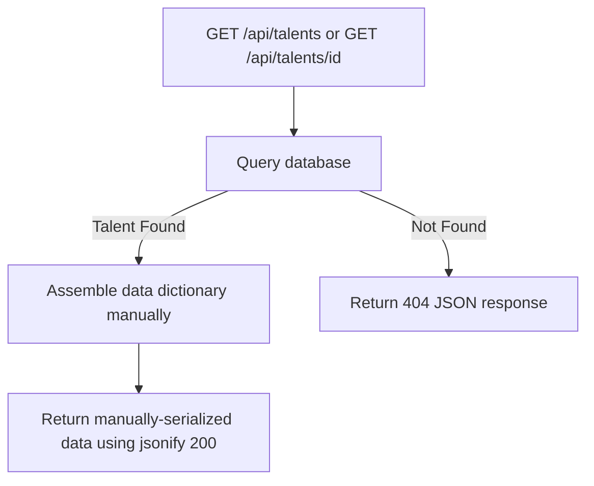
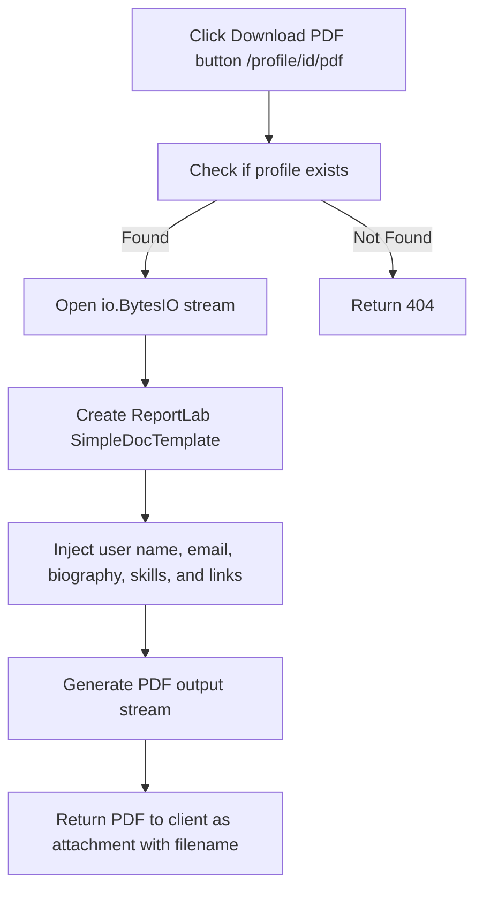

# Logical Workflows & Validations Guide

This document outlines the directory structure, file responsibilities, validation systems, and data workflows of the Flask Talent Portal.

---

## 1. Directory Tree & File Highlights

```text
hc--talentapp-main/
│
├── config.py                 # Application configuration values (database, secrets, uploads)
├── run.py                    # Application launch script
│
└── app/                      # Main application module
    ├── __init__.py           # Application factory pattern constructor
    ├── models.py             # Database model definitions (SQLAlchemy)
    ├── schemas.py            # Form validation schemas (Pydantic v2)
    │
    ├── blueprints/           # Blueprint controllers (business logic and routes)
    │   ├── auth.py           # Onboarding, sessions, rate limits
    │   ├── main.py           # Landing, search, admin dashboard, JSON APIs
    │   └── profile.py        # Talent profile creation, editing, viewing, and PDF export
    │
    ├── static/               # Static directory
    │   └── uploads/          # Uploaded profile photos directory
    │
    └── templates/            # HTML views
        ├── base.html         # Master styling and base page structure
        ├── admin_talents.html# Admin panel list and delete table
        ├── profile_form.html # Create / edit profile form
        ├── profile_view.html # Public profile details with PDF export link
        │
        ├── auth/             # Onboarding views
        │   ├── login.html
        │   ├── register.html
        │   └── change_password.html
        │
        └── main/             # Navigation views
            ├── browse.html   # Paginated search directory
            └── dashboard.html# User dashboard status center
```

### File Highlights
*   `run.py`: Standard script launching the app context.
*   `config.py`: Limits uploaded file sizes (`MAX_CONTENT_LENGTH = 2 * 1024 * 1024` / 2MB) and defines image type lists.
*   `app/__init__.py`: Connects extensions (`db`, `login_manager`) to the Flask app object and runs `db.create_all()` to provision the database.
*   `app/models.py`: Houses the database structure.
*   `app/schemas.py`: Prevents invalid database entries by filtering inputs before they reach database commits.
*   `app/blueprints/auth.py`: Directs registration, rate limits IPs, and manages sessions.
*   `app/blueprints/profile.py`: Processes profile creation/modification and compiles PDF records.
*   `app/blueprints/main.py`: Coordinates admin panels, deletion queries, search criteria, and JSON web endpoints.

---

## 2. Core Validation Rules

### A. Database Models (`app/models.py` & `app/schemas.py`)
*   **Username**: Must match regex `^[a-zA-Z0-9_]{3,20}$` (3 to 20 alphanumeric characters or underscores only).
*   **Email**: Checked against regular expression `^[a-zA-Z0-9_.+-]+@[a-zA-Z0-9-]+\.[a-zA-Z0-9-.]+$`. Length restricted to 120 characters max.
*   **Password**: Checked against regular expression `^(?=.*[A-Z])(?=.*\d)(?=.*[\W_]).{8,32}$` (8 to 32 characters, requiring at least one uppercase letter, one digit, and one special character).
*   **Biography**: Required field, maximum length capped at 500 characters.
*   **Skills**: Must contain at least one skill.
*   **URLs (GitHub, LinkedIn, Website)**: Checked against URL validation patterns.
*   **Profile Photo**: Restricts attachments to allowed extensions (`png`, `jpg`, `jpeg`, `webp`).

---

## 3. Logical Phase Workflows

### Phase 1: User Registration


### Phase 2: Login Flow


### Phase 3: Profile Creation & Modification


### Phase 4: Admin Management & Profile Deletion


### Phase 5: REST API Access


### Phase 6: PDF Profile Export

